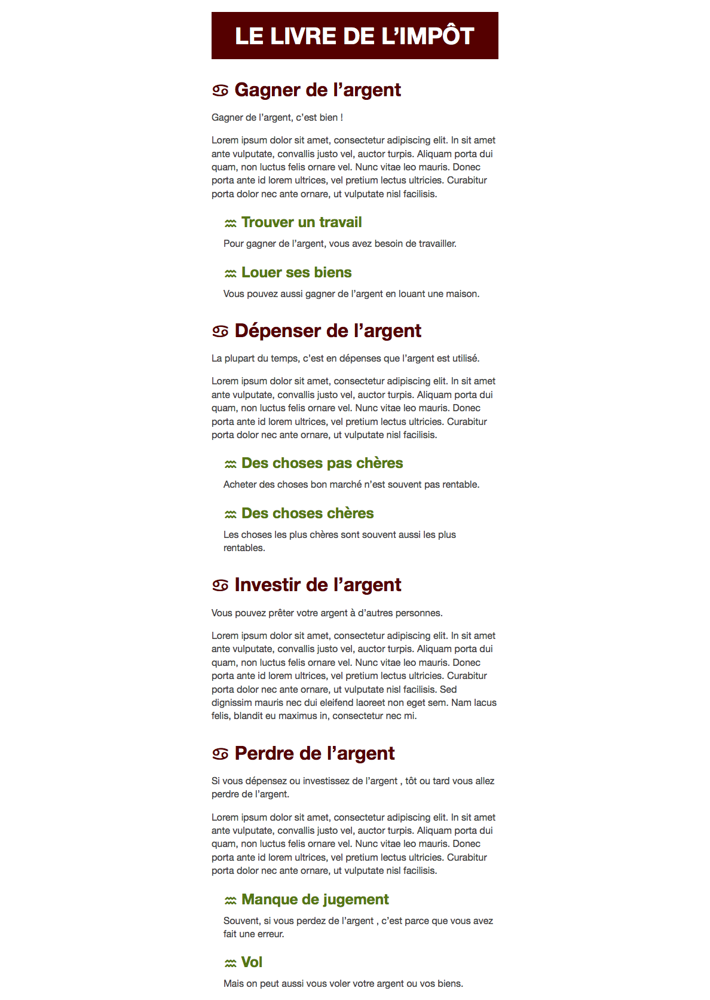
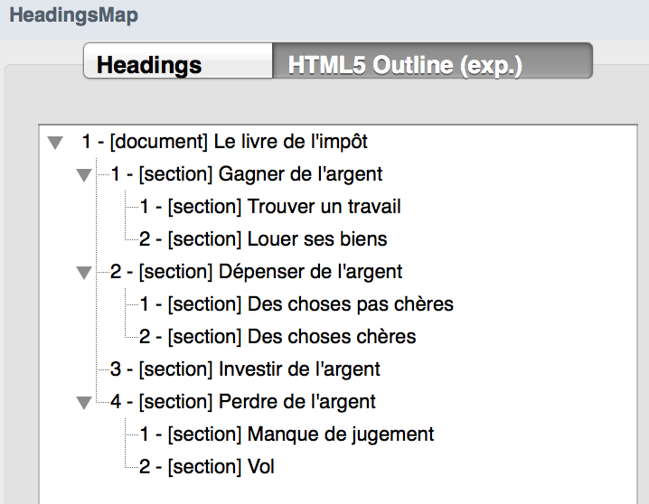
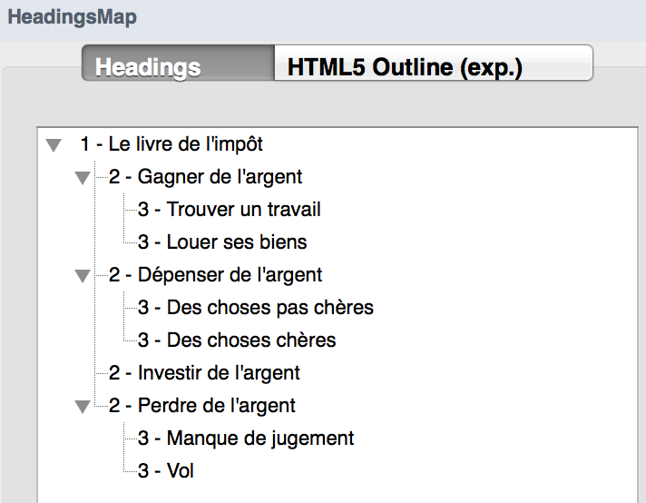

# html-outline-taxbook

> HTML exercise about HTML outline algorithm

* * *

**html-outline-taxbook** is an educational project, which will be used for HTML courses.

**Note:** the school where the course is given, the [HEPL](http://www.hepl.be) from Liège, Belgium, is a french-speaking school. From this point, the instruction will be in french. Sorry.

* * *

## Exercice sur l’algorithme Outline HTML

Créez le fichier `index.html` avec les bonnes balises afin d’arriver au résultat suivant :

Vous trouverez le contenu textuel dans le fichier `impot.txt`.
Veillez à obtenir un outline (ou plan du document) compatible en :

**HTML5** : 

et en **HTML4** :

N’oubliez pas de lier la feuille de styles qui se trouve dans le dossier `css`.